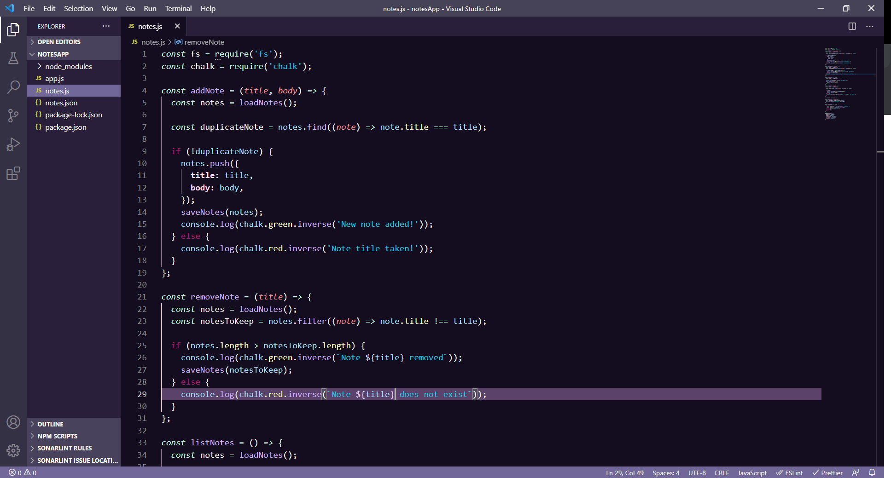

# Midnight Mermaid VS Code Theme

This theme is based off of theacodes [Witch Hazel](https://github.com/theacodes/witchhazel) with changes made to read JavaScript easier.
  - The workbench is darker.
  - Added many TextMate tokenColorCustomizations for readability. 
  
---
### Installation

- Dowload this repo
- import it to your `.vscode/extentions/` folder
- Open VS Code
- In Settings>Color Theme, choose Midnight Mermaid

---

